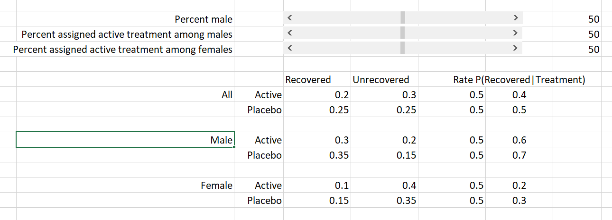
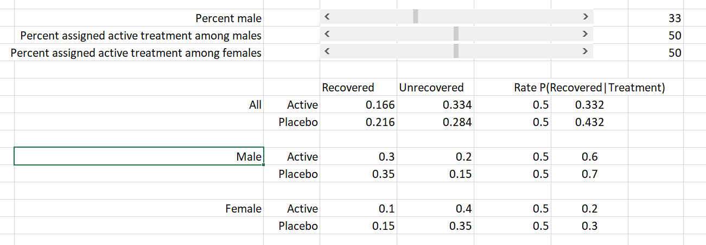
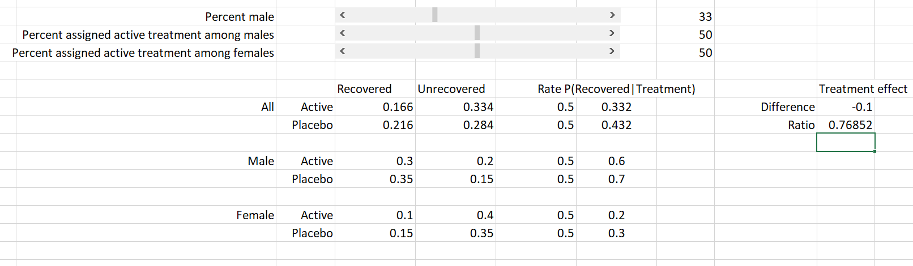

# HW 13: Confounding and randomization

1. The following screen shot shows the contingency table when treatment allocation is balanced.  The spreadsheet with sliders is available in the HW folder.



2. The following screen shot shows the contingency table when treatment allocation is balanced.



3. $\Delta$ is the treatment effect on the absolute scale, and $\rho$ is the treatment effect on the relative scale.  $\rho$ is relative because it is the ratio of the two quantities.

4. $\Delta$ and $\rho$ are shown below in the screen shots of scenario 1 and scenarior 2.




As the proportion of males/females changes, the treatment effect on the absolute scale ($\Delta$) stays the same.

5. Even though the data appeared to be identical between the medical and agricultural examples, in the agricultural example, height was not a confounding variable.  It is a trait that is not known at planting, and it does not impact the variety of seed. Rather, variety impacts height.  As a variable on the causal pathway, it would be inappriopriate to adjust/stratify on this trait.

In contrast, because sex was a confounding variable in the medical example, we would adjust/stratify.

6. Below, note that the direction of the arrows is different.  Variety impacts height, not the other way around.


7. 

```{r}
diab <- sample(rep(1:2,times=c(12,13)), 25)
nodiab <- sample(rep(1:2,times=c(38,37)),75)

data.frame(
    diabetes_assignment = c(diab, rep("",50)),
    no_diabetes_assignment = nodiab
)

```
