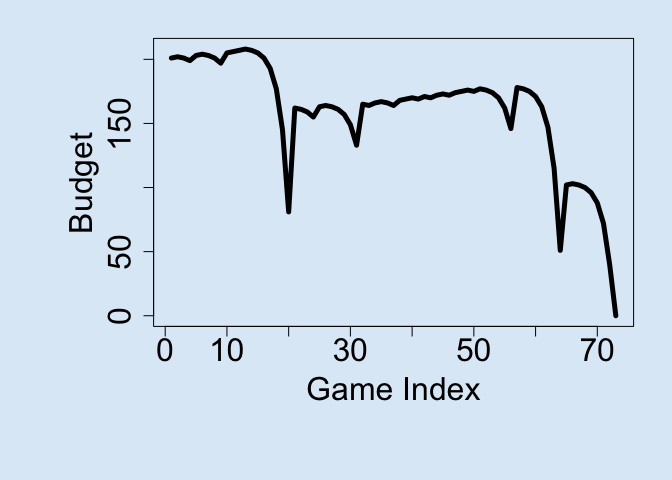
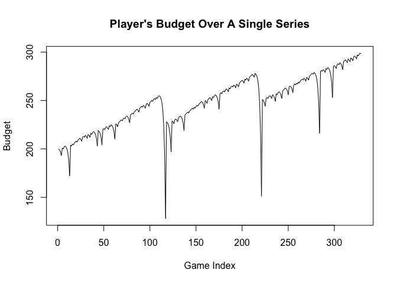
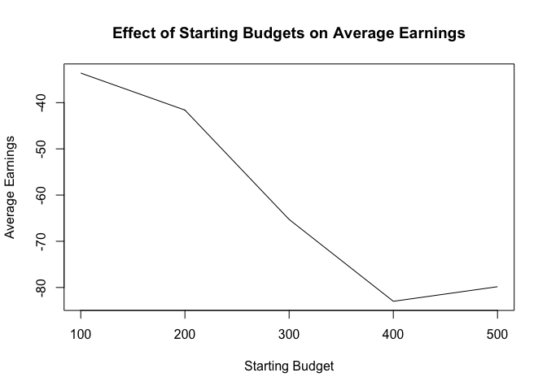

## Introduction

Below is code to help update your Deliverable 1 reports. I have not
included the written portions of the blog post, but the code should help
you create the necessary components to then explain.

## Provided Code

    single_spin <- function(){
      possible_outcomes <- c(rep("red",18), rep("black",18), rep("green",2))
      sample(possible_outcomes, 1)
    }

    martingale_wager <- function(
        previous_wager
      , previous_outcome
      , max_wager
      , current_budget
    ){
      if(previous_outcome == "red") return(1)
      min(2*previous_wager, max_wager, current_budget)
    }

    one_play <- function(previous_ledger_entry, max_wager){
      # Create a copy of the input object that will become the output object
      out <- previous_ledger_entry
      out[1, "game_index"] <- previous_ledger_entry[1, "game_index"] + 1
      out[1, "starting_budget"] <- previous_ledger_entry[1, "ending_budget"]
      out[1, "wager"] <- martingale_wager(
        previous_wager = previous_ledger_entry[1, "wager"]
        , previous_outcome = previous_ledger_entry[1, "outcome"]
        , max_wager = max_wager
        , current_budget = out[1, "starting_budget"]
      )
      out[1, "outcome"] <- single_spin()
      out[1, "ending_budget"] <- out[1, "starting_budget"] + 
        ifelse(out[1, "outcome"] == "red", +1, -1)*out[1, "wager"]
      return(out)
    }

    one_series <- function(
      max_games, starting_budget, winning_threshold, max_wager
    ){
      # Initialize ledger
      ledger <- data.frame(
          game_index = 0:max_games
        , starting_budget = NA_integer_
        , wager = NA_integer_
        , outcome = NA_character_
        , ending_budget = NA_integer_
      )
      ledger[1, "wager"] <- 1
      ledger[1, "outcome"] <- "red"
      ledger[1, "ending_budget"] <- starting_budget
      for(i in 2:nrow(ledger)){
        #browser()
        ledger[i,] <- one_play(ledger[i-1,], max_wager)
        if(stopping_rule(ledger[i,], winning_threshold)) break
      }
      # Return non-empty portion of ledger
      ledger[2:i, ]
    }

    stopping_rule <- function(
      ledger_entry
      , winning_threshold
    ){
      ending_budget <- ledger_entry[1, "ending_budget"]
      if(ending_budget <= 0) return(TRUE)
      if(ending_budget >= winning_threshold) return(TRUE)
      FALSE
    }

    profit <- function(ledger){
      n <- nrow(ledger)
      profit <- ledger[n, "ending_budget"] - ledger[1, "starting_budget"]
      return(profit)
    }

    require(magrittr)

    ## Loading required package: magrittr

    svg(filename = "loser.svg", width=16, height =9)
    par(cex.axis=2, cex.lab = 2, mar = c(8,8,2,2), bg = rgb(222, 235, 247, max = 255))
    set.seed(1)
    ledger <- one_series(200,200,300,500)
    plot(ledger[,c(1,5)], type = "l", lwd = 5, xlab = "Game Index", ylab = "Budget")

    dev.off()

    ## null device 
    ##           1

    svg(filename = "winner.svg", width=16, height =9)
    par(cex.axis=2, cex.lab = 2, mar = c(8,8,2,2), bg = rgb(222, 235, 247, max = 255))
    set.seed(2)
    l2 <- one_series(200,200,300,500)
    plot(l2[,c(1,5)], type = "l", lwd = 5, xlab = "Game Index", ylab = "Budget")
    dev.off()

    ## null device 
    ##           1

## Time Series

You can run with different seeds 1-3 times to get a sense of the
variability of a player’s budget trajectory. It’s good to show that it
can be either positive (winning) or negative (losing).

    # create a ledger using the default parameters
    # default parameters come from the assignment instructions

    set.seed(20302)
    ledger <- one_series(1000, 200, 300, 100)

    # showing what the ledger is
    head(ledger)

    ##   game_index starting_budget wager outcome ending_budget
    ## 2          1             200     1   black           199
    ## 3          2             199     2   black           197
    ## 4          3             197     4   black           193
    ## 5          4             193     8     red           201
    ## 6          5             201     1   black           200
    ## 7          6             200     2     red           202

    # plot the ledger
    plot(ledger$game_index, ledger$starting_budget, 
         xlab = 'Game Index', 
         ylab = 'Budget',
         main = "Player's Budget Over A Single Series",
         type = 'l')

## Average Earnings

We want to replicate the one\_series() command many times, calculate the
profit each time, and then take the mean after all of the replications.

    # we can do one_series 1000 times then take mean profit
    # using the default parameters from the instructions

    replicate(1000, one_series(1000, 200, 300, 100) |> profit()) |> mean()

    ## [1] -48.824

## Changing Parameters Effect

You can repeat this process for the other parameters as well. This
example is looking at starting budget. Just make sure that that all
combinations of the parameters makes sense. For example, you don’t want
the starting budget to be greater than the winning threshold, otherwise
the game stops right away.

    # ex. Starting Budget

    # get a range of starting budgets
    starting_budgets <- seq(100, 500, by = 100)

    # create a vector to store the average earnings for each starting budget
    # make it the length of the starting budgets we are looping over
    ae <- numeric(length(starting_budgets))

    # create a for loop, going through each starting budget value
    for(i in 1:length(starting_budgets)){
      # replicate 1000 times with these settings, changing the starting budget each time
      # winning threshold is 100 more than the starting budget each time
      # could also just set winning threshold to be a large number that starting budget
      # never goes over
      # ae[i] stores the average earning in the ith place
      # starting_budgets[i] selects the ith starting budget to use for this loop
      ae[i] <- replicate(1000, one_series(1000, 
                                          starting_budgets[i], 
                                          starting_budgets[i] + 100, 
                                          100) |> profit()) |> mean()
    }

    # now plot the results
    # starting budget on the x-axis, average earnings on the y-axis

    plot(starting_budgets, ae, 
         main = 'Effect of Starting Budgets on Average Earnings',
         ylab = 'Average Earnings',
         xlab = 'Starting Budget',
         type = 'l')

## Number of Plays

This can be a plot as well across a certain parameter value. This is
calculating with the default parameters to get a point estimate.

    # each row in the ledger is one play, we can get the number of plays using the number of rows

    replicate(1000, one_series(1000, 200, 300, 100) |> nrow()) |> mean()

    ## [1] 200.219
