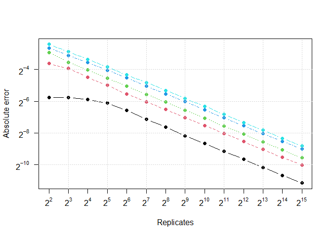

# Error as a function of the number of replicates

    # Function which includes the replicate step
    error_v4 <- function(r,n,p){
        d1 <- rbinom(r,n,p)
        phat <-d1/n
        ae <- abs(phat - p)
        re <- ae/p
        c(mean(ae), mean(re))
    }

    ns <- 2^(2:15)
    ps <- c(0.01, 0.05, 0.1, 0.25, 0.5)
    out <- expand.grid(N=ns, P=ps, AE = NA, RE = NA, KEEP.OUT.ATTRS = FALSE)

    for(i in 1:nrow(out)){
      out[i, 3:4] <- error_v4(10000,n=out$N[i],p=out$P[i])
    }

    a1 <- array(out[,"AE"],dim=c(length(ns), length(ps)))

    matplot(log2(a1), type = "b", pch = 16, axes=FALSE, ylab = "Absolute error", xlab = "Replicates")
    axis(1,1:14,parse(text=paste0("2^",2:15)))
    axis(2, axTicks(2), parse(text=paste0("2^",axTicks(2))), las = 1)
    box()
    grid()

Note that relationship between replicates and absolute error is linear
when plotted on the log scale.

log2(*E*) = *α* + *β*log2(*R*)

Looking at the plot, we see that the slope, *β*, is $-\frac{1}{2}$. The
formula can be reexpressed in the following ways:

$$
\begin{aligned}
\log\_2(E) &= \alpha - \frac{1}{2} \log\_2(R) \\
2^{\log\_2(E)} &= 2^{\alpha - \frac{1}{2} \log\_2(R)} \\
E &= 2^{\alpha}R^{-\frac{1}{2}} \\
 &= \frac{2^{\alpha}}{\sqrt{R}}
\end{aligned}
$$

This equation gives a way to understand the relationship between the
number of replicates and the error. With it, we can answer the question:
“If we want to reduce the error by half, how many additional replicates
are needed?”

$$
\begin{aligned}
\frac{1}{2}E &= \frac{1}{2}\frac{2^{\alpha}}{\sqrt{R}} \\
&= \frac{2^{\alpha}}{2\sqrt{R}} \\
&= \frac{2^{\alpha}}{\sqrt{4R}} \\
\end{aligned}
$$

> **IMPORTANT POINT:** In order to reduce the error by half, the number
> of replicates must be **quadrupled**!

We can see this looking at specific values of *p* and *n*.

## N = 100 & 400

    error_v4(100000, 100, 0.5)/2

    ## [1] 0.02000235 0.04000470

    error_v4(100000, 400, 0.5)

    ## [1] 0.01993627 0.03987255

## N = 1000 & 4000

    error_v4(100000, 1000, 0.5)/2

    ## [1] 0.00631466 0.01262932

    error_v4(100000, 4000, 0.5)

    ## [1] 0.006301267 0.012602535
