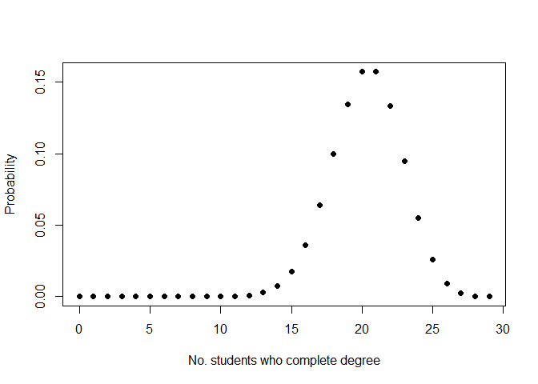
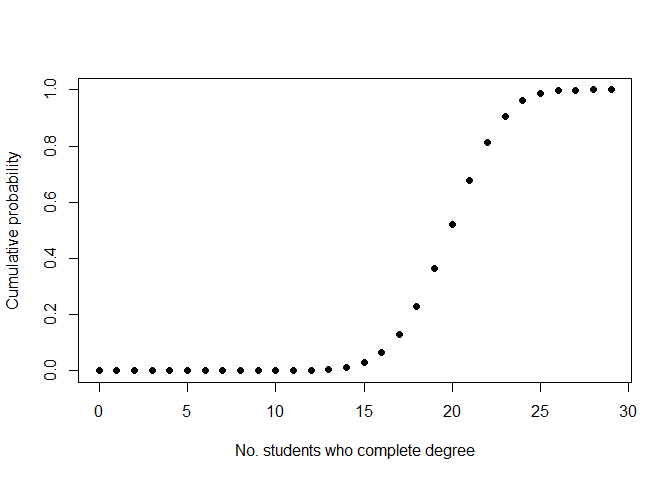
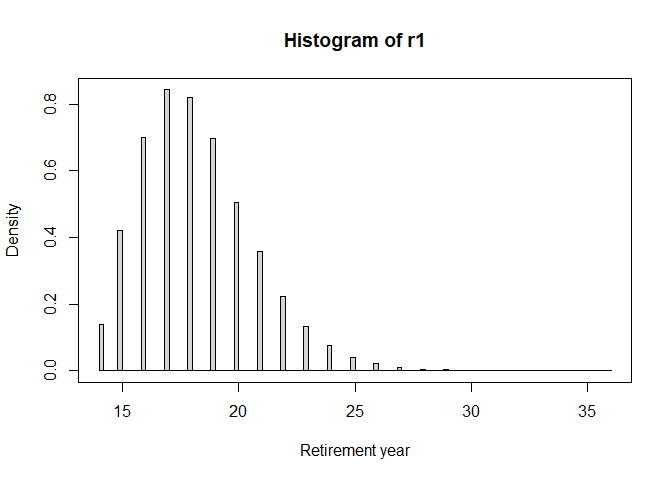
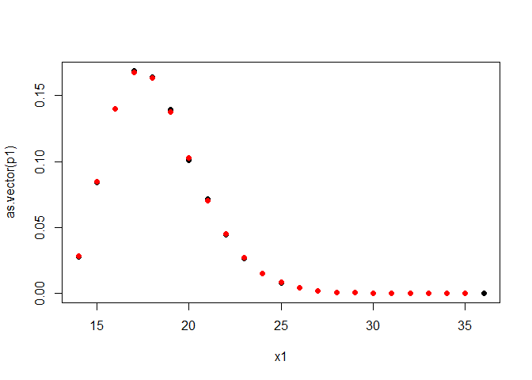

# Binomial and negative binomial distribution practice problems

Please complete the following problems.

1.  The probability of completing a difficult PhD program is 0.7.
    Calculate the probability that in a cohort of 29 students, 3 or
    fewer students do not complete the degree.

<!-- -->

    pbinom(3,29,1-0.7)

    ## [1] 0.01209502

1.  Let X be the number of students who complete a difficult PhD program
    in a cohort of 29 students. Generate a plot of the probability mass
    function and cumulative probability function for X. Let *p* = 0.7,
    as in the previous problem.

<!-- -->

    x <- 0:29
    p <- dbinom(x,29,0.7)
    plot(x,p,ylab = "Probability", xlab = "No. students who complete degree", pch = 16)

    plot(x,cumsum(p), ylab = "Cumulative probability", xlab = "No. students who complete degree", pch = 16)

1.  Suppose *p* was unknown and needed to be estimated from data.
    Suppose 22 completed in a cohort of 29. Estimate *p* with maximum
    likelihood. Generate a 1/20 support interval. This may help:
    [link](hw15a-maximum-likelihood.md)

<!-- -->

    Follow instructions in linked hint.

1.  Suppose *p* was unknown and needed to be estimated from data.
    Suppose 22 completed in a cohort of 29. Estimate *p* was a Bayesian
    Posterior. Generate a 0.95 credible interval. This may help:
    [link](hw15b-bayesian-posterior.md)

<!-- -->

    Follow instructions in linked hint.

1.  In this difficult program, students complete the degree after 5
    years (no variation). A professor decides to stop taking new
    students after advising 10 students to completion. She also decides
    to retire after all of her active students graduate. If the
    professor only takes 1 student a year (at the start of the program),
    what is the probability that the professor will be retired in 20
    years? (As above, *p* = 0.7)

<!-- -->

    # Simulation solution
    one_rep <- function(){
        z <- rbinom(100,1,0.7)
        which(cumsum(z) == 10)[1] + 4
    }
    r1 <- replicate(100000, one_rep())
    hist(r1, breaks = 100, freq = FALSE, xlab = "Retirement year")
    box()

    mean(r1 <= 20)

    ## [1] 0.825

    # Analytic solution
    # P(Y <= 20)
    # P(X + 4 <= 20) where X = year of 10th sucess
    # P(X <= 16)
    # P(W + 10 <= 16) where W = number of failures before 10 success
    # P(W <= 6)
    pnbinom(6, 10, 0.7)

    ## [1] 0.8246866

    # Comparison of Simulation and analytic solutions
    p1 <- table(r1) |> proportions()
    x1 <- names(p1) |> as.numeric()
    plot(x1, as.vector(p1), pch = 16)
    x <- 14:35
    y <- dnbinom(x-10-4,10,0.7)
    points(x,y,col = "red", pch = 16)

1.  3 prizes are awarded to the first 3 correct solutions of a difficult
    problem. Suppose the probability of a correct solution is 0.1. What
    is the probability that all three prizes will be awarded by the 25th
    submission?

<!-- -->

    # Simulation
    one_rep <- function(){
        z <- rbinom(300,1,0.1)
        which(cumsum(z) == 3)[1]
    }
    r1 <- replicate(100000, one_rep())
    mean(r1<=25)

    ## [1] 0.46331

    # Analytic solution
    pnbinom(22,3,0.1)

    ## [1] 0.4629059
