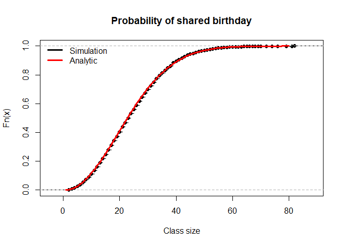

Please read section 5.1 through 5.5 of Understanding Probability.

Consider a sporting competition between team A and B. The teams play a
series of games, only stopping when one of the teams wins 4 games. As
there are no ties, so the series will end after 4, 5, 6, or 7 games.

The table below reports the joint probabilities for the number of games
played (N = 4,5,6, or 7) and the winning team (W = A or B)

<table>
<thead>
<tr class="header">
<th></th>
<th>A</th>
<th>B</th>
</tr>
</thead>
<tbody>
<tr class="odd">
<td>4</td>
<td>0.03</td>
<td>0.11</td>
</tr>
<tr class="even">
<td>5</td>
<td>0.08</td>
<td>0.18</td>
</tr>
<tr class="odd">
<td>6</td>
<td>0.11</td>
<td>0.19</td>
</tr>
<tr class="even">
<td>7</td>
<td>0.13</td>
<td>0.17</td>
</tr>
</tbody>
</table>

Use the basic rules of probability to answer questions 1 - 4.

1.  What is the probability that the series ends in 5 or 6 games?

The series ending in 5 or 6 games corresponds to the bolded cells below.
The probability of ending in 5 or 6 games is the sum of the cell
probabilities.

<table>
<thead>
<tr class="header">
<th></th>
<th>A</th>
<th>B</th>
</tr>
</thead>
<tbody>
<tr class="odd">
<td>4</td>
<td>0.03</td>
<td>0.11</td>
</tr>
<tr class="even">
<td>5</td>
<td><strong>0.08</strong></td>
<td><strong>0.18</strong></td>
</tr>
<tr class="odd">
<td>6</td>
<td><strong>0.11</strong></td>
<td><strong>0.19</strong></td>
</tr>
<tr class="even">
<td>7</td>
<td>0.13</td>
<td>0.17</td>
</tr>
</tbody>
</table>

    0.08 + 0.18 + 0.11 + 0.19

    ## [1] 0.56

1.  What is the probability that team A will win supposing the series
    ends in 6 games?

The probability in question is a conditional (row) probability
*P*(A wins|ends in 6 games)

<table>
<thead>
<tr class="header">
<th></th>
<th>A</th>
<th>B</th>
<th></th>
</tr>
</thead>
<tbody>
<tr class="odd">
<td>4</td>
<td>0.03</td>
<td>0.11</td>
<td></td>
</tr>
<tr class="even">
<td>5</td>
<td>0.08</td>
<td>0.18</td>
<td></td>
</tr>
<tr class="odd">
<td>6</td>
<td>0.11</td>
<td>0.19</td>
<td>0.3</td>
</tr>
<tr class="even">
<td>row</td>
<td><strong>0.11/0.3</strong></td>
<td>0.19/0.3</td>
<td></td>
</tr>
<tr class="odd">
<td>7</td>
<td>0.13</td>
<td>0.17</td>
<td></td>
</tr>
</tbody>
</table>

    0.11/(0.11+0.19)

    ## [1] 0.3666667

1.  What is the probability that team B wins the series or that the
    series will end after an even number of games?

The event in question corresponds to the bolded cells below. The
probability is calculated by summing the bolded cell probabilities. We
can also use the complement rule.

<table>
<thead>
<tr class="header">
<th></th>
<th>A</th>
<th>B</th>
</tr>
</thead>
<tbody>
<tr class="odd">
<td>4</td>
<td><strong>0.03</strong></td>
<td><strong>0.11</strong></td>
</tr>
<tr class="even">
<td>5</td>
<td>0.08</td>
<td><strong>0.18</strong></td>
</tr>
<tr class="odd">
<td>6</td>
<td><strong>0.11</strong></td>
<td><strong>0.19</strong></td>
</tr>
<tr class="even">
<td>7</td>
<td>0.13</td>
<td><strong>0.17</strong></td>
</tr>
</tbody>
</table>

    #complement rule
    1-0.08-0.13

    ## [1] 0.79

1.  What is the probability the series will end in 5 or fewer games
    supposing that A wins the series?

This is a conditional probability.

*P*(ends in 4 or 5 games|A wins)

<table>
<thead>
<tr class="header">
<th></th>
<th>A</th>
</tr>
</thead>
<tbody>
<tr class="odd">
<td>4</td>
<td><strong>0.03</strong></td>
</tr>
<tr class="even">
<td>5</td>
<td><strong>0.08</strong></td>
</tr>
<tr class="odd">
<td>6</td>
<td><em>0.11</em></td>
</tr>
<tr class="even">
<td>7</td>
<td><em>0.13</em></td>
</tr>
</tbody>
</table>

Considering only the A wins column the probability is the sum of the
bolded cells divided by the marginal probability.

    pa <- 0.03+0.08+0.11+0.13 #margin
    (0.03+0.08)/pa

    ## [1] 0.3142857

1.  In section 5.5, the author provides an analytic solution to the
    birthday problem. Calculate the shared birthday probability
    analytically for a class of size 11. How does the value compare with
    the solution you generated computationally in hw6? (Copy/run your
    code from HW6 to empirically compute the solution.)

In the author’s solution, the compliment and multiplication rules were
applied. Here is the formula:

$$
P(\text{At least one shared birthday in class roster of size } k) = 1 - \frac{365!}{(365-k)! \\ 365^k}.
$$

As noted in class, we want to reexpress the formula because our laptops
cannot compute 365!.

*P*(At least one shared birthday in class roster of size *k*) = 1 − exp {log (365!) − log ((365−*k*)!) − *k*log (365)}.

In R, the command for log of the factorial is `lfactorial`.

    birthday_prob <- function(k) 1 - exp(lfactorial(365) - lfactorial(365-k) - k*log(365))
    birthday_prob(11)

    ## [1] 0.1411414

We can compare our analytic solution to the simulation solution from
HW6:

    first_duplicate <- function(){
        sample(1:365, 366, replace=TRUE) |>
        duplicated() |>
        which() |>
        min()
    }

    R <- 10000
    fd1 <- replicate(R, first_duplicate())
    plot(ecdf(fd1), main = "Probability of shared birthday", xlab = "Class size")

    class_sizes <- 1:80
    analytic_birthday_prob <- birthday_prob(class_sizes)
    lines(class_sizes, analytic_birthday_prob, col = "red", lwd = 3)
    legend("topleft", legend = c("Simulation","Analytic"), col = c("black","red"), lwd = 3, bty = "n")

The simulation error for a class of size 11 is 0.0038414.
